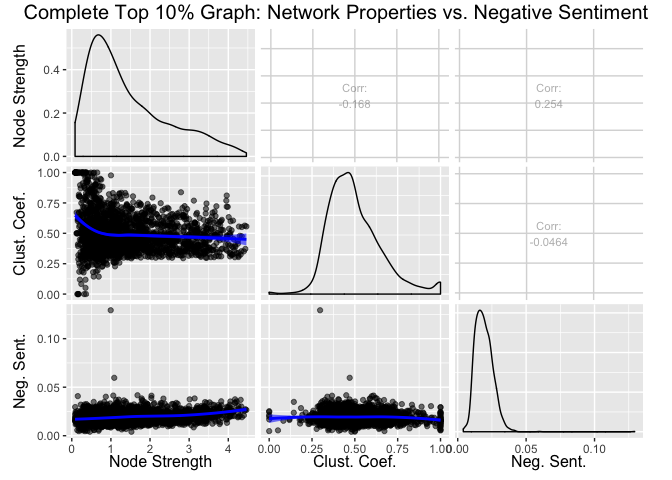
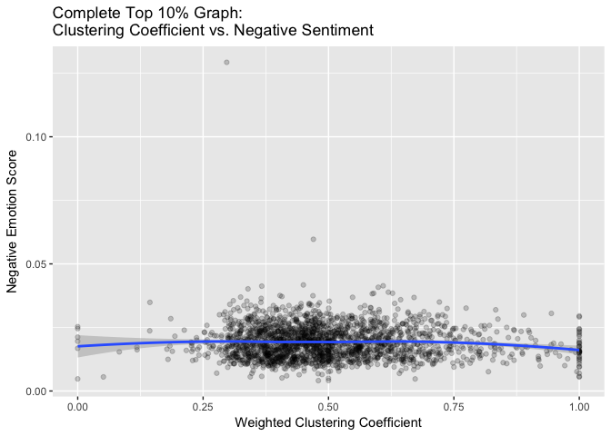
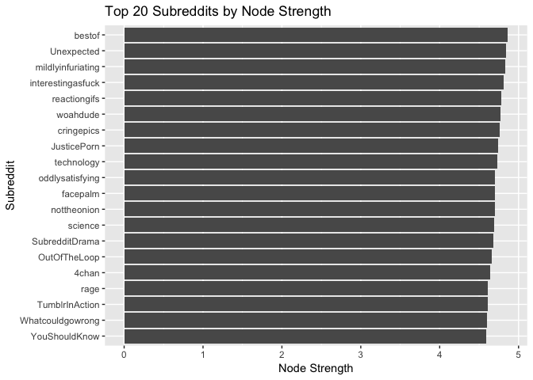
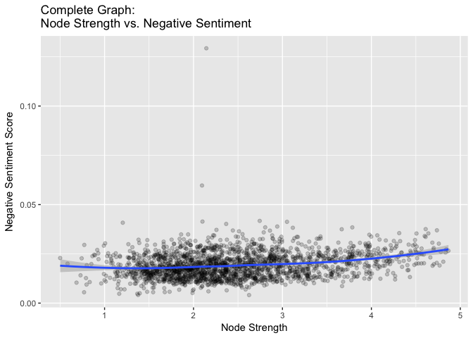

Clustering Coefficient Analysis
================
Samuel Hansen

Network Properties vs. Negative Sentiment
=========================================

Complete Graph
--------------

Complete Graph Filtered to Top 10% of Edge Weights
--------------------------------------------------

Clustering coefficient vs. negative sentiment
=============================================

Complete Graph
--------------

We can examine whether a relationship exists between the weighted clustering coefficient and negative sentiment by examining the following plot and inspecting a linear regression analysis. 

### Linear Regression: Clusterting Coefficient vs. Negative Sentiment

    ## 
    ## Call:
    ## lm(formula = negemo ~ complete_clust_coef, data = df)
    ## 
    ## Residuals:
    ##       Min        1Q    Median        3Q       Max 
    ## -0.015161 -0.004759 -0.000667  0.003979  0.110055 
    ## 
    ## Coefficients:
    ##                       Estimate Std. Error t value Pr(>|t|)    
    ## (Intercept)          0.0193548  0.0007355  26.316   <2e-16 ***
    ## complete_clust_coef -0.0001874  0.0010487  -0.179    0.858    
    ## ---
    ## Signif. codes:  0 '***' 0.001 '**' 0.01 '*' 0.05 '.' 0.1 ' ' 1
    ## 
    ## Residual standard error: 0.006638 on 2046 degrees of freedom
    ## Multiple R-squared:  1.561e-05,  Adjusted R-squared:  -0.0004731 
    ## F-statistic: 0.03194 on 1 and 2046 DF,  p-value: 0.8582

There appears to be a **no** statistically significant relationship between clustering coefficient and negative sentiment.

Complete Graph Filtered to Top 10% of Edge Weights
--------------------------------------------------

We can examine whether a relationship exists between the weighted clustering coefficient and negative sentiment by examining the following plot and inspecting a linear regression analysis. 

### Linear Regression: Clusterting Coefficient vs. Negative Sentiment

    ## 
    ## Call:
    ## lm(formula = negemo ~ complete_top10_clust_coef, data = df)
    ## 
    ## Residuals:
    ##       Min        1Q    Median        3Q       Max 
    ## -0.015462 -0.004725 -0.000644  0.003963  0.109668 
    ## 
    ## Coefficients:
    ##                             Estimate Std. Error t value Pr(>|t|)    
    ## (Intercept)                0.0202158  0.0004896  41.287   <2e-16 ***
    ## complete_top10_clust_coef -0.0019582  0.0009336  -2.097   0.0361 *  
    ## ---
    ## Signif. codes:  0 '***' 0.001 '**' 0.01 '*' 0.05 '.' 0.1 ' ' 1
    ## 
    ## Residual standard error: 0.006639 on 2039 degrees of freedom
    ##   (7 observations deleted due to missingness)
    ## Multiple R-squared:  0.002153,   Adjusted R-squared:  0.001664 
    ## F-statistic: 4.399 on 1 and 2039 DF,  p-value: 0.03608

There is a weak, yet statistically significant negative relationship between clustering coefficient and negative sentiment.

### LOESS Regression: Clusterting Coefficient vs. Negative Sentiment

    ## Call:
    ## loess(formula = negemo ~ complete_top10_clust_coef, data = df)
    ## 
    ## Number of Observations: 2041 
    ## Equivalent Number of Parameters: 5.59 
    ## Residual Standard Error: 0.00663 
    ## Trace of smoother matrix: 6.12  (exact)
    ## 
    ## Control settings:
    ##   span     :  0.75 
    ##   degree   :  2 
    ##   family   :  gaussian
    ##   surface  :  interpolate      cell = 0.2
    ##   normalize:  TRUE
    ##  parametric:  FALSE
    ## drop.square:  FALSE

What is the distribution of node strength?
==========================================

Complete Reddit Graph
---------------------

### Top 20 Subreddits by Node Strength

### Node Strength vs. Negative Sentiment

### Linear Regression: Node Strength vs. Negative Sentiment

    ## 
    ## Call:
    ## lm(formula = negemo ~ complete_ns, data = df)
    ## 
    ## Residuals:
    ##       Min        1Q    Median        3Q       Max 
    ## -0.015438 -0.004497 -0.000560  0.003544  0.110690 
    ## 
    ## Coefficients:
    ##              Estimate Std. Error t value Pr(>|t|)    
    ## (Intercept) 0.0145645  0.0004498   32.38   <2e-16 ***
    ## complete_ns 0.0018877  0.0001727   10.93   <2e-16 ***
    ## ---
    ## Signif. codes:  0 '***' 0.001 '**' 0.01 '*' 0.05 '.' 0.1 ' ' 1
    ## 
    ## Residual standard error: 0.006452 on 2046 degrees of freedom
    ## Multiple R-squared:  0.05515,    Adjusted R-squared:  0.05468 
    ## F-statistic: 119.4 on 1 and 2046 DF,  p-value: < 2.2e-16
