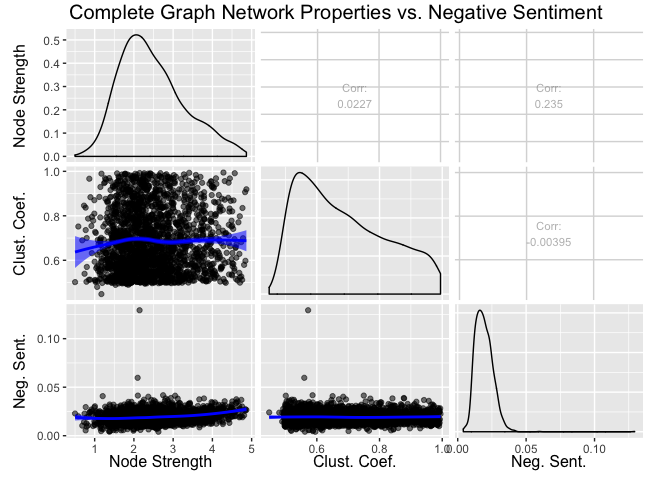
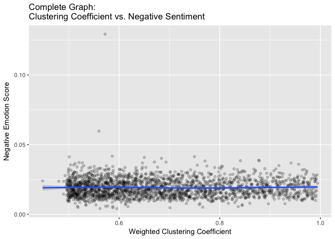

Clustering Coefficient Analysis
================
Samuel Hansen

What is the relationship between clustering coefficient and negative sentiment?
===============================================================================

Complete Graph
--------------

We can examine whether a relationship exists between the weighted clustering coefficient and negative sentiment by examining the following plot and inspecting a linear regression analysis.

``` r
df %>%
  ggplot(mapping = aes(x = complete_clust_coef, y = negemo)) +
  geom_point(alpha = 0.2) +
  geom_smooth(method = "loess") +
  labs(x = "Weighted Clustering Coefficient", 
       y = "Negative Emotion Score",
       title = "Complete Graph: \nClustering Coefficient vs. Negative Sentiment") 
```



``` r
lm.fit <- lm(negemo ~ complete_clust_coef, data = df)
summary(lm.fit)
```

    ## 
    ## Call:
    ## lm(formula = negemo ~ complete_clust_coef, data = df)
    ## 
    ## Residuals:
    ##       Min        1Q    Median        3Q       Max 
    ## -0.015161 -0.004759 -0.000667  0.003979  0.110055 
    ## 
    ## Coefficients:
    ##                       Estimate Std. Error t value Pr(>|t|)    
    ## (Intercept)          0.0193548  0.0007355  26.316   <2e-16 ***
    ## complete_clust_coef -0.0001874  0.0010487  -0.179    0.858    
    ## ---
    ## Signif. codes:  0 '***' 0.001 '**' 0.01 '*' 0.05 '.' 0.1 ' ' 1
    ## 
    ## Residual standard error: 0.006638 on 2046 degrees of freedom
    ## Multiple R-squared:  1.561e-05,  Adjusted R-squared:  -0.0004731 
    ## F-statistic: 0.03194 on 1 and 2046 DF,  p-value: 0.8582

There appears to be a **no** statistically significant relationship between clustering coefficient and negative sentiment.

Complete Graph Filtered to Top 10% of Edge Weights
--------------------------------------------------

We can examine whether a relationship exists between the weighted clustering coefficient and negative sentiment by examining the following plot and inspecting a linear regression analysis.

``` r
df %>%
  ggplot(mapping = aes(x = complete_top10_clust_coef, y = negemo)) +
  geom_point(alpha = 0.2) +
  geom_smooth(method = "loess") +
  labs(x = "Weighted Clustering Coefficient", 
       y = "Negative Emotion Score",
       title = "Complete Top 10% Graph: \nClustering Coefficient vs. Negative Sentiment") 
```

    ## Warning: Removed 7 rows containing non-finite values (stat_smooth).

    ## Warning: Removed 7 rows containing missing values (geom_point).



``` r
lm.fit <- lm(negemo ~ complete_top10_clust_coef, data = df)
summary(lm.fit)
```

    ## 
    ## Call:
    ## lm(formula = negemo ~ complete_top10_clust_coef, data = df)
    ## 
    ## Residuals:
    ##       Min        1Q    Median        3Q       Max 
    ## -0.015462 -0.004725 -0.000644  0.003963  0.109668 
    ## 
    ## Coefficients:
    ##                             Estimate Std. Error t value Pr(>|t|)    
    ## (Intercept)                0.0202158  0.0004896  41.287   <2e-16 ***
    ## complete_top10_clust_coef -0.0019582  0.0009336  -2.097   0.0361 *  
    ## ---
    ## Signif. codes:  0 '***' 0.001 '**' 0.01 '*' 0.05 '.' 0.1 ' ' 1
    ## 
    ## Residual standard error: 0.006639 on 2039 degrees of freedom
    ##   (7 observations deleted due to missingness)
    ## Multiple R-squared:  0.002153,   Adjusted R-squared:  0.001664 
    ## F-statistic: 4.399 on 1 and 2039 DF,  p-value: 0.03608

``` r
loess.fit <- loess(negemo ~ complete_top10_clust_coef, data = df)
summary(loess.fit)
```

    ## Call:
    ## loess(formula = negemo ~ complete_top10_clust_coef, data = df)
    ## 
    ## Number of Observations: 2041 
    ## Equivalent Number of Parameters: 5.59 
    ## Residual Standard Error: 0.00663 
    ## Trace of smoother matrix: 6.12  (exact)
    ## 
    ## Control settings:
    ##   span     :  0.75 
    ##   degree   :  2 
    ##   family   :  gaussian
    ##   surface  :  interpolate      cell = 0.2
    ##   normalize:  TRUE
    ##  parametric:  FALSE
    ## drop.square:  FALSE

There appears to be a weak, yet statistically significant relationship between clustering coefficient and negative sentiment.

Regression of negative sentiment onto all LIWC features & Clustering Coefficient
================================================================================

``` r
# complete_top10_lm.fit <- lm(negemo ~., data = df %>% 
#      select(-c(subreddit, complete_clust_coef, complete_log_clust_coef,
#                complete_top10_log_clust_coef)))
# summary(complete_top10_lm.fit)
```

``` r
# IGNORE THIS CODE FOR NOW 
df <-
  df %>%
  mutate(quartile = ifelse(complete_top10_clust_coef <= 
                             quantile(complete_top10_clust_coef, prob = .25, na.rm = T),
                           "bottom_25",
                           ifelse(complete_top10_clust_coef >= 
                                    quantile(complete_top10_clust_coef, prob = .75, na.rm = T),
                                  "top_25", "middle")))
df %>%
  filter(quartile != "middle") %>%
  ggplot(mapping = aes(x = quartile, y = negemo)) +
  geom_bar(stat = "identity") +
  labs(x = "Weighted Clustering Coefficient Quartile",
       y = "Negative Sentiment Score",
       title = "Negative Sentiment vs. Top & Bottom Clustering Coefficient Quartiles")
```


