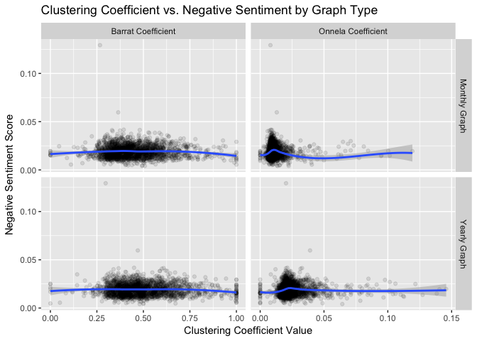
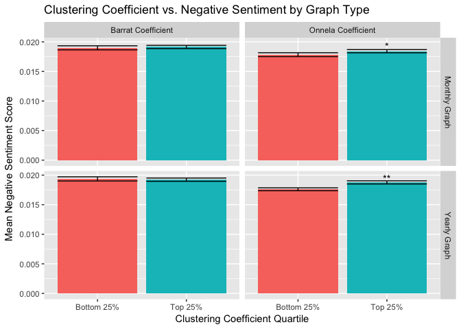
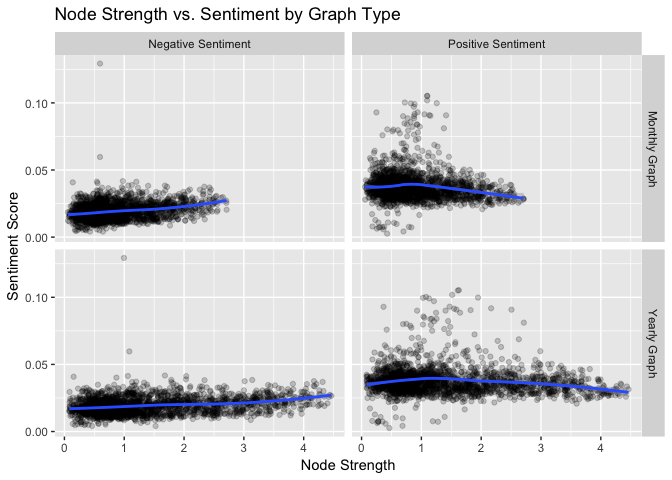
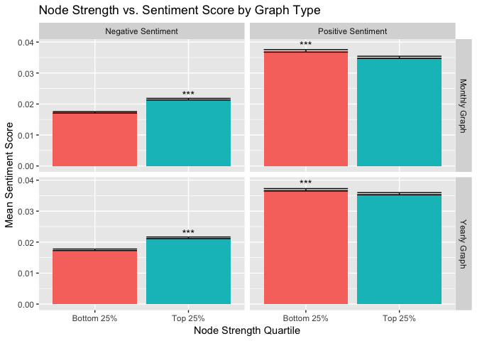
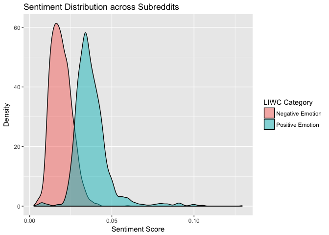
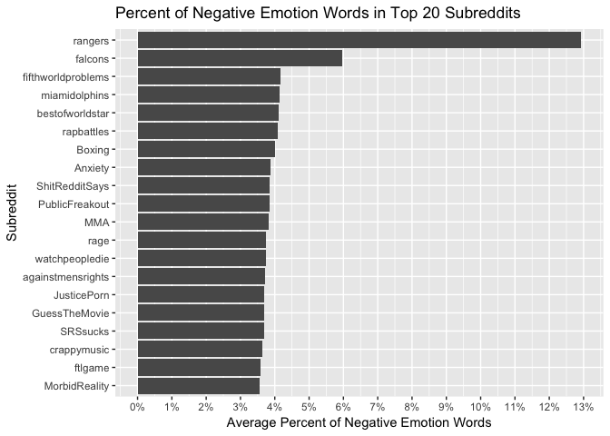
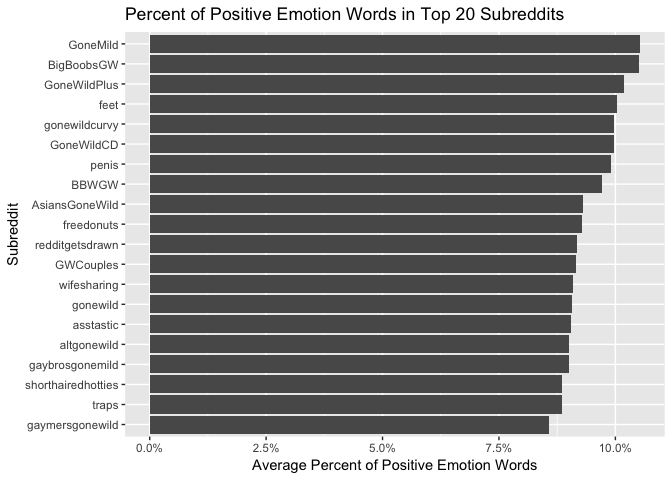
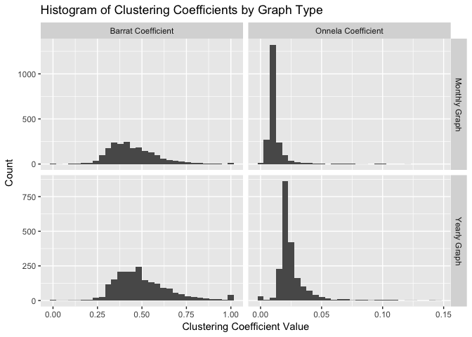
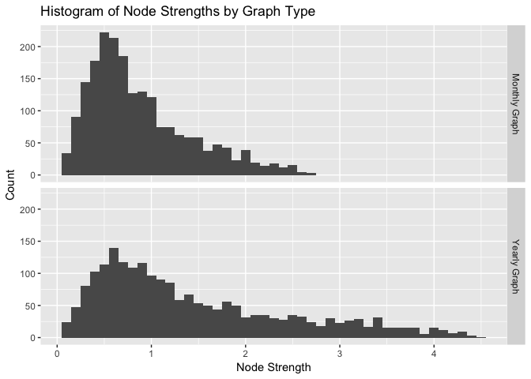

Clustering Coefficient Comparison
================
Samuel Hansen

-   [Clustering Coefficient vs. Negative Sentiment by Graph Type](#clustering-coefficient-vs.-negative-sentiment-by-graph-type)
    -   [Scatterplots](#scatterplots)
    -   [Barplots](#barplots)
    -   [Mann-Whitney Tests](#mann-whitney-tests)
        -   [Negative Sentiment vs. Onnela Coefficient](#negative-sentiment-vs.-onnela-coefficient)
        -   [Negative Sentiment vs. Barrat Coefficient](#negative-sentiment-vs.-barrat-coefficient)
-   [Node Strength vs. Negative Sentiment](#node-strength-vs.-negative-sentiment)
    -   [Scatterplots](#scatterplots-1)
    -   [Barplots](#barplots-1)
    -   [Mann-Whitney Tests](#mann-whitney-tests-1)
        -   [Negative Sentiment vs. Node Strength](#negative-sentiment-vs.-node-strength)
        -   [Positive Sentiment vs. Node Strength](#positive-sentiment-vs.-node-strength)
-   [Distribution Summaries](#distribution-summaries)
    -   [Distributions of Positive vs. Negative Sentiment](#distributions-of-positive-vs.-negative-sentiment)
    -   [Subreddits with Highest Negative Sentiment](#subreddits-with-highest-negative-sentiment)
    -   [Subreddits with Highest Positive Sentiment](#subreddits-with-highest-positive-sentiment)
    -   [Distributions of Clustering Coefficients by Graph Type](#distributions-of-clustering-coefficients-by-graph-type)
    -   [Distributions of Node Strength by Graph Type](#distributions-of-node-strength-by-graph-type)

Clustering Coefficient vs. Negative Sentiment by Graph Type
===========================================================

Scatterplots
------------

Barplots
--------

Mann-Whitney Tests
------------------

### Negative Sentiment vs. Onnela Coefficient

#### Monthly Graph

    ## 
    ##  Wilcoxon rank sum test with continuity correction
    ## 
    ## data:  negemo by quartile
    ## W = 119350, p-value = 0.01321
    ## alternative hypothesis: true location shift is not equal to 0

#### Yearly Graph

    ## 
    ##  Wilcoxon rank sum test with continuity correction
    ## 
    ## data:  negemo by quartile
    ## W = 115210, p-value = 0.001144
    ## alternative hypothesis: true location shift is not equal to 0

### Negative Sentiment vs. Barrat Coefficient

#### Monthly Graph

    ## 
    ##  Wilcoxon rank sum test with continuity correction
    ## 
    ## data:  negemo by quartile
    ## W = 126260, p-value = 0.3097
    ## alternative hypothesis: true location shift is not equal to 0

#### Yearly Graph

    ## 
    ##  Wilcoxon rank sum test with continuity correction
    ## 
    ## data:  negemo by quartile
    ## W = 129750, p-value = 0.8637
    ## alternative hypothesis: true location shift is not equal to 0

Node Strength vs. Negative Sentiment
====================================

Scatterplots
------------

Barplots
--------

Mann-Whitney Tests
------------------

### Negative Sentiment vs. Node Strength

#### Monthly Graph

    ## 
    ##  Wilcoxon rank sum test with continuity correction
    ## 
    ## data:  score by quartile
    ## W = 78039, p-value < 2.2e-16
    ## alternative hypothesis: true location shift is not equal to 0

#### Yearly Graph

    ## 
    ##  Wilcoxon rank sum test with continuity correction
    ## 
    ## data:  score by quartile
    ## W = 82047, p-value < 2.2e-16
    ## alternative hypothesis: true location shift is not equal to 0

### Positive Sentiment vs. Node Strength

#### Monthly Graph

    ## 
    ##  Wilcoxon rank sum test with continuity correction
    ## 
    ## data:  score by quartile
    ## W = 160120, p-value = 8.293e-10
    ## alternative hypothesis: true location shift is not equal to 0

#### Yearly Graph

    ## 
    ##  Wilcoxon rank sum test with continuity correction
    ## 
    ## data:  score by quartile
    ## W = 150600, p-value = 2.16e-05
    ## alternative hypothesis: true location shift is not equal to 0

Distribution Summaries
======================

Distributions of Positive vs. Negative Sentiment
------------------------------------------------

Positive sentiment is higher than negative sentiment across subreddits, on average.

Subreddits with Highest Negative Sentiment
------------------------------------------

Subreddits with the highest negative sentiment tend to be related to **Sports**.

Subreddits with Highest Positive Sentiment
------------------------------------------

Subreddits with the highest negative sentiment tend to be **NSFW**.

Distributions of Clustering Coefficients by Graph Type
------------------------------------------------------

Distributions of Node Strength by Graph Type
--------------------------------------------

