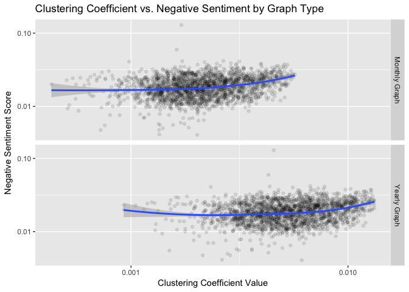
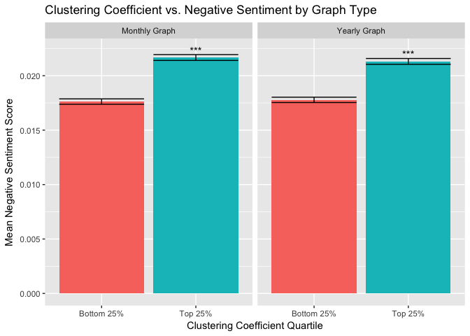
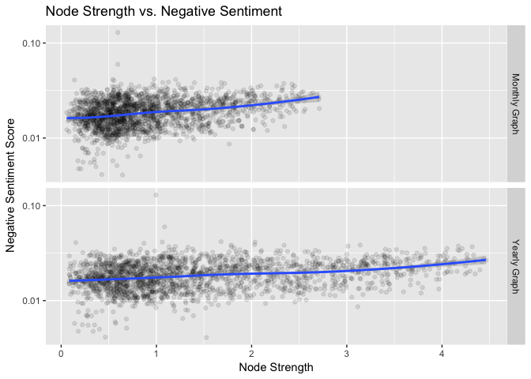
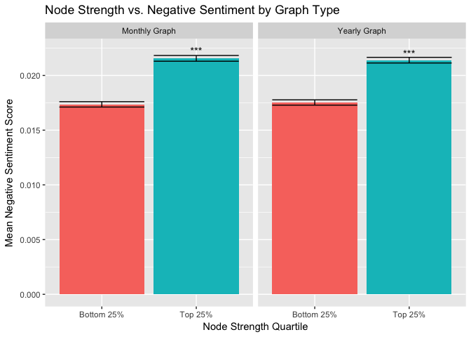
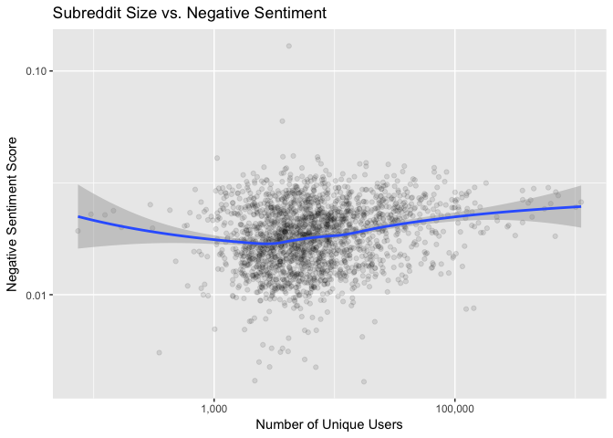
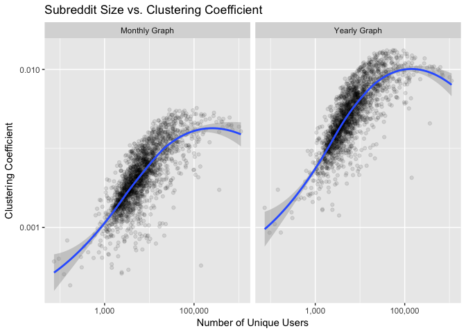

Final Analysis
================
Samuel Hansen

-   [Networks with Unfiltered Edges](#networks-with-unfiltered-edges)
    -   [Clustering Coefficient vs. Negative Sentiment](#clustering-coefficient-vs.-negative-sentiment)
        -   [Scatterplot](#scatterplot)
        -   [Regression](#regression)
        -   [Barplot](#barplot)
        -   [Mann-Whitney Tests](#mann-whitney-tests)
    -   [Node Strength vs. Negative Sentiment](#node-strength-vs.-negative-sentiment)
        -   [Scatterplot](#scatterplot-1)
        -   [Regression](#regression-1)
        -   [Barplot](#barplot-1)
        -   [Mann-Whitney Tests](#mann-whitney-tests-1)
    -   [Subreddit Size vs. Negative Sentiment](#subreddit-size-vs.-negative-sentiment)
        -   [Scatterplot](#scatterplot-2)
        -   [Regression](#regression-2)
    -   [Subreddit Size vs. Clustering Coefficient](#subreddit-size-vs.-clustering-coefficient)
        -   [Scatterplot](#scatterplot-3)

Networks with Unfiltered Edges
==============================

Clustering Coefficient vs. Negative Sentiment
---------------------------------------------

### Scatterplot

### Regression

#### Yearly Graph

    ## 
    ## Call:
    ## lm(formula = log10(negemo) ~ log10(clustering_coefficient), data = df %>% 
    ##     filter(network_type == "yearly", percent_edges_filtered == 
    ##         "100%"))
    ## 
    ## Residuals:
    ##      Min       1Q   Median       3Q      Max 
    ## -0.65991 -0.09617  0.00827  0.09663  0.86157 
    ## 
    ## Coefficients:
    ##                               Estimate Std. Error t value Pr(>|t|)    
    ## (Intercept)                   -1.37320    0.03708  -37.03   <2e-16 ***
    ## log10(clustering_coefficient)  0.16087    0.01620    9.93   <2e-16 ***
    ## ---
    ## Signif. codes:  0 '***' 0.001 '**' 0.01 '*' 0.05 '.' 0.1 ' ' 1
    ## 
    ## Residual standard error: 0.1429 on 2046 degrees of freedom
    ## Multiple R-squared:  0.04598,    Adjusted R-squared:  0.04551 
    ## F-statistic: 98.61 on 1 and 2046 DF,  p-value: < 2.2e-16

#### Monthly Graph

    ## 
    ## Call:
    ## lm(formula = log10(negemo) ~ log10(clustering_coefficient), data = df %>% 
    ##     filter(network_type == "monthly", percent_edges_filtered == 
    ##         "100%"))
    ## 
    ## Residuals:
    ##      Min       1Q   Median       3Q      Max 
    ## -0.64578 -0.09572  0.00854  0.09796  0.86864 
    ## 
    ## Coefficients:
    ##                               Estimate Std. Error t value Pr(>|t|)    
    ## (Intercept)                   -1.23886    0.04502  -27.52   <2e-16 ***
    ## log10(clustering_coefficient)  0.18721    0.01677   11.16   <2e-16 ***
    ## ---
    ## Signif. codes:  0 '***' 0.001 '**' 0.01 '*' 0.05 '.' 0.1 ' ' 1
    ## 
    ## Residual standard error: 0.1421 on 2046 degrees of freedom
    ## Multiple R-squared:  0.0574, Adjusted R-squared:  0.05694 
    ## F-statistic: 124.6 on 1 and 2046 DF,  p-value: < 2.2e-16

### Barplot

### Mann-Whitney Tests

#### Yearly Graph

    ## 
    ##  Wilcoxon rank sum test with continuity correction
    ## 
    ## data:  negemo by quartile
    ## W = 88091, p-value < 2.2e-16
    ## alternative hypothesis: true location shift is not equal to 0

#### Monthly Graph

    ## 
    ##  Wilcoxon rank sum test with continuity correction
    ## 
    ## data:  negemo by quartile
    ## W = 82076, p-value < 2.2e-16
    ## alternative hypothesis: true location shift is not equal to 0

Node Strength vs. Negative Sentiment
------------------------------------

### Scatterplot

### Regression

#### Yearly Graph

    ## 
    ## Call:
    ## lm(formula = log10(negemo) ~ node_strength, data = df %>% filter(network_type == 
    ##     "yearly", percent_edges_filtered == "100%"))
    ## 
    ## Residuals:
    ##      Min       1Q   Median       3Q      Max 
    ## -0.65220 -0.09271  0.01157  0.09289  0.86930 
    ## 
    ## Coefficients:
    ##                Estimate Std. Error t value Pr(>|t|)    
    ## (Intercept)   -1.796757   0.005420 -331.48   <2e-16 ***
    ## node_strength  0.039261   0.003063   12.82   <2e-16 ***
    ## ---
    ## Signif. codes:  0 '***' 0.001 '**' 0.01 '*' 0.05 '.' 0.1 ' ' 1
    ## 
    ## Residual standard error: 0.1409 on 2039 degrees of freedom
    ##   (7 observations deleted due to missingness)
    ## Multiple R-squared:  0.07458,    Adjusted R-squared:  0.07413 
    ## F-statistic: 164.3 on 1 and 2039 DF,  p-value: < 2.2e-16

A 1 unit change in node strength is associated with a 0.044% change in negative sentiment. \#\#\#\#Monthly Graph

    ## 
    ## Call:
    ## lm(formula = log10(negemo) ~ log10(node_strength), data = df %>% 
    ##     filter(network_type == "monthly", percent_edges_filtered == 
    ##         "100%"))
    ## 
    ## Residuals:
    ##      Min       1Q   Median       3Q      Max 
    ## -0.64219 -0.09587  0.01086  0.09494  0.86322 
    ## 
    ## Coefficients:
    ##                       Estimate Std. Error t value Pr(>|t|)    
    ## (Intercept)          -1.720948   0.003491 -492.92   <2e-16 ***
    ## log10(node_strength)  0.136140   0.011094   12.27   <2e-16 ***
    ## ---
    ## Signif. codes:  0 '***' 0.001 '**' 0.01 '*' 0.05 '.' 0.1 ' ' 1
    ## 
    ## Residual standard error: 0.1414 on 2039 degrees of freedom
    ##   (7 observations deleted due to missingness)
    ## Multiple R-squared:  0.06877,    Adjusted R-squared:  0.06831 
    ## F-statistic: 150.6 on 1 and 2039 DF,  p-value: < 2.2e-16

### Barplot

### Mann-Whitney Tests

#### Yearly Graph

    ## 
    ##  Wilcoxon rank sum test with continuity correction
    ## 
    ## data:  negemo by quartile
    ## W = 82047, p-value < 2.2e-16
    ## alternative hypothesis: true location shift is not equal to 0

#### Monthly Graph

    ## 
    ##  Wilcoxon rank sum test with continuity correction
    ## 
    ## data:  negemo by quartile
    ## W = 78599, p-value < 2.2e-16
    ## alternative hypothesis: true location shift is not equal to 0

Subreddit Size vs. Negative Sentiment
-------------------------------------

### Scatterplot

### Regression

    ## 
    ## Call:
    ## lm(formula = log10(negemo) ~ log10(unique_users), data = df %>% 
    ##     distinct(subreddit, unique_users, negemo))
    ## 
    ## Residuals:
    ##      Min       1Q   Median       3Q      Max 
    ## -0.67343 -0.09425  0.00839  0.09665  0.86433 
    ## 
    ## Coefficients:
    ##                     Estimate Std. Error t value Pr(>|t|)    
    ## (Intercept)         -1.96818    0.02504 -78.596   <2e-16 ***
    ## log10(unique_users)  0.05949    0.00648   9.181   <2e-16 ***
    ## ---
    ## Signif. codes:  0 '***' 0.001 '**' 0.01 '*' 0.05 '.' 0.1 ' ' 1
    ## 
    ## Residual standard error: 0.1434 on 2046 degrees of freedom
    ## Multiple R-squared:  0.03957,    Adjusted R-squared:  0.0391 
    ## F-statistic: 84.29 on 1 and 2046 DF,  p-value: < 2.2e-16

Subreddit Size vs. Clustering Coefficient
-----------------------------------------

### Scatterplot

