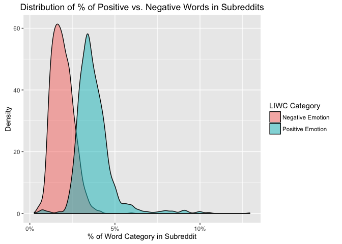
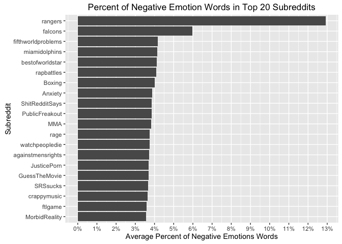
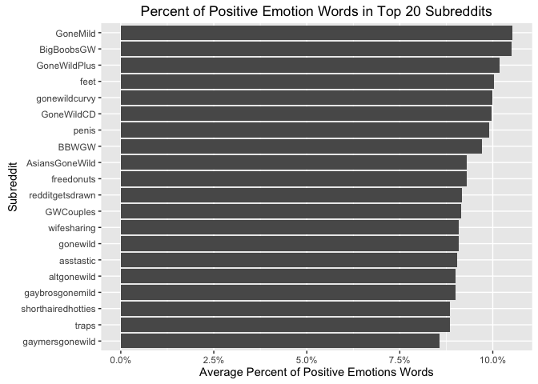
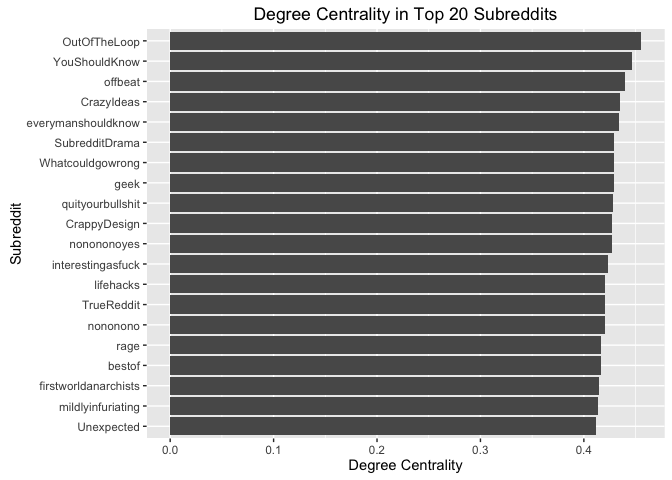
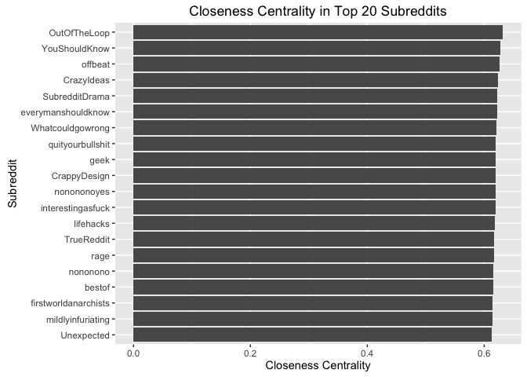
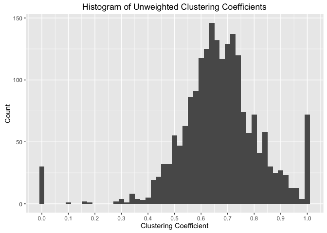
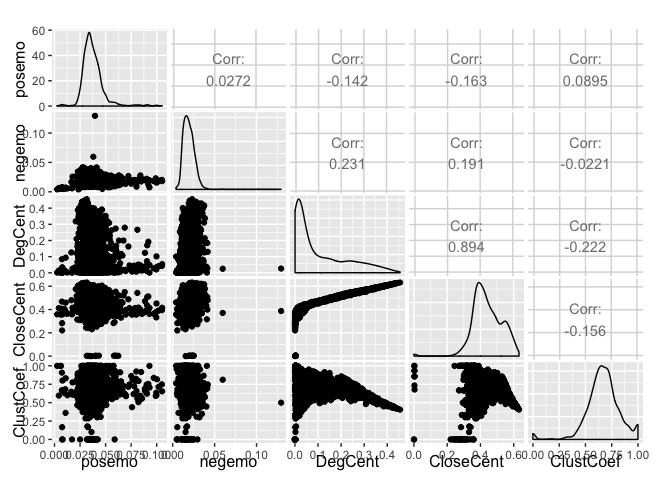
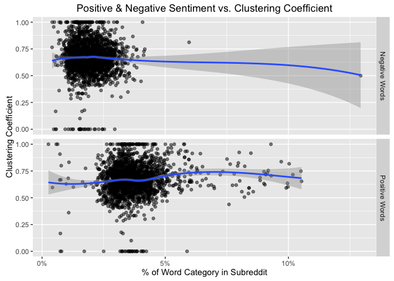

Overview
========

This study examines the relationship between LIWC variables and network variables derived from the network containing the top 10% of the edges by edge weight.

Distributions of Sentiment
==========================

Distributions of Positive vs. Negative Sentiment
------------------------------------------------

Positive sentiment is higher than negative sentiment across subreddits, on average.

Subreddits with Highest Negative Sentiment
------------------------------------------

Subreddits with the highest negative sentiment tend to be related to **Sports**.

Subreddits with Highest Positive Sentiment
------------------------------------------

Subreddits with the highest negative sentiment tend to be **NSFW**.

Distribution of Network Variables
=================================

Subreddits with Highest Degree Centrality
-----------------------------------------

Subreddits with Highest Closeness Centrality
--------------------------------------------

Histogram of Unweighted Clustering Coefficients
-----------------------------------------------

Network Variables vs. Sentiment
===============================

We inspect the pairwise relationships between network variables and sentiment scores in the following plot: 

The relationship between sentiment scores and clustering coefficient seems to be weak. To take a closer look, the following plots depict the relationship between *unweighted* clustering coefficient and positive and negative sentiment. 

The straight line of the LOESS smoother indicates the relationship between sentiment and clustering coefficient is weak. However, we can confirm this by inspecting the output from regressions of positive and negative sentiment onto clustering coefficient.

### Regression of Positive Sentiment onto Network Variables

    ## 
    ## Call:
    ## lm(formula = posemo ~ DegCent + CloseCent + ClustCoef, data = df)
    ## 
    ## Residuals:
    ##       Min        1Q    Median        3Q       Max 
    ## -0.037970 -0.006029 -0.001651  0.003868  0.067515 
    ## 
    ## Coefficients:
    ##              Estimate Std. Error t value Pr(>|t|)    
    ## (Intercept)  0.044528   0.002430  18.322  < 2e-16 ***
    ## DegCent      0.004353   0.004563   0.954  0.34022    
    ## CloseCent   -0.024155   0.006080  -3.973 7.35e-05 ***
    ## ClustCoef    0.004704   0.001518   3.099  0.00197 ** 
    ## ---
    ## Signif. codes:  0 '***' 0.001 '**' 0.01 '*' 0.05 '.' 0.1 ' ' 1
    ## 
    ## Residual standard error: 0.01044 on 2037 degrees of freedom
    ##   (7 observations deleted due to missingness)
    ## Multiple R-squared:  0.03122,    Adjusted R-squared:  0.0298 
    ## F-statistic: 21.88 on 3 and 2037 DF,  p-value: 6.02e-14

There is a weak, yet highly significant relationship between positive sentiment and closeness centrality that implies a 1 unit increase in closeness centrality is associated with a -0.0241554 unit change in positive sentiment. Further, we also observe a significant relationship with unweighted clustering coefficient that suggests a 1% increase in clustering coefficient is associated with a 0.0047043 unit change in positive sentiment.

### Regression of Negative Sentiment onto Network Variables

    ## 
    ## Call:
    ## lm(formula = negemo ~ DegCent + CloseCent + ClustCoef, data = df)
    ## 
    ## Residuals:
    ##       Min        1Q    Median        3Q       Max 
    ## -0.015125 -0.004549 -0.000587  0.003588  0.111331 
    ## 
    ## Coefficients:
    ##               Estimate Std. Error t value Pr(>|t|)    
    ## (Intercept)  0.0193218  0.0015048  12.840  < 2e-16 ***
    ## DegCent      0.0181302  0.0028254   6.417 1.73e-10 ***
    ## CloseCent   -0.0066008  0.0037647  -1.753   0.0797 .  
    ## ClustCoef    0.0014528  0.0009398   1.546   0.1223    
    ## ---
    ## Signif. codes:  0 '***' 0.001 '**' 0.01 '*' 0.05 '.' 0.1 ' ' 1
    ## 
    ## Residual standard error: 0.006462 on 2037 degrees of freedom
    ##   (7 observations deleted due to missingness)
    ## Multiple R-squared:  0.05558,    Adjusted R-squared:  0.05419 
    ## F-statistic: 39.96 on 3 and 2037 DF,  p-value: < 2.2e-16

Only degree centrality as a significant positive relationship with negative sentiment such that a 1 unit change in degree centrality is associated with a 0.0181302 unit change in negative sentiment.
