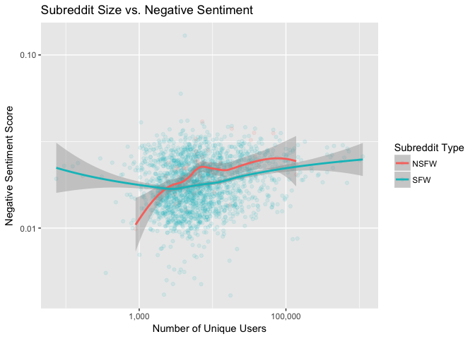

NSFW Analysis
================
Samuel Hansen

-   [Networks with Unfiltered Edges](#networks-with-unfiltered-edges)
    -   [Clustering Coefficient vs. Negative Sentiment](#clustering-coefficient-vs.-negative-sentiment)
        -   [Scatterplot](#scatterplot)
        -   [Regression](#regression)
        -   [Barplot](#barplot)
        -   [Mann-Whitney Tests](#mann-whitney-tests)
    -   [Node Strength vs. Negative Sentiment](#node-strength-vs.-negative-sentiment)
        -   [Scatterplot](#scatterplot-1)
        -   [Regression](#regression-1)
        -   [Barplot](#barplot-1)
        -   [Mann-Whitney Tests](#mann-whitney-tests-1)
    -   [Subreddit Size vs. Negative Sentiment](#subreddit-size-vs.-negative-sentiment)
        -   [Scatterplot](#scatterplot-2)
        -   [Regression](#regression-2)
    -   [Subreddit Size vs. Clustering Coefficient](#subreddit-size-vs.-clustering-coefficient)
        -   [Scatterplot](#scatterplot-3)

Networks with Unfiltered Edges
==============================

Clustering Coefficient vs. Negative Sentiment
---------------------------------------------

### Scatterplot

### Regression

#### Yearly Graph

    ## 
    ## Call:
    ## lm(formula = log10(negemo) ~ log10(clustering_coefficient) + 
    ##     nsfw_status, data = df %>% filter(network_type == "yearly", 
    ##     percent_edges_filtered == "100%"))
    ## 
    ## Residuals:
    ##      Min       1Q   Median       3Q      Max 
    ## -0.65727 -0.09387  0.00487  0.09578  0.86506 
    ## 
    ## Coefficients:
    ##                               Estimate Std. Error t value Pr(>|t|)    
    ## (Intercept)                   -1.29090    0.04108 -31.427  < 2e-16 ***
    ## log10(clustering_coefficient)  0.16750    0.01619  10.348  < 2e-16 ***
    ## nsfw_statusSFW                -0.07026    0.01540  -4.564 5.32e-06 ***
    ## ---
    ## Signif. codes:  0 '***' 0.001 '**' 0.01 '*' 0.05 '.' 0.1 ' ' 1
    ## 
    ## Residual standard error: 0.1422 on 2045 degrees of freedom
    ## Multiple R-squared:  0.0556, Adjusted R-squared:  0.05468 
    ## F-statistic:  60.2 on 2 and 2045 DF,  p-value: < 2.2e-16

#### Monthly Graph

    ## 
    ## Call:
    ## lm(formula = log10(negemo) ~ log10(clustering_coefficient) + 
    ##     +nsfw_status, data = df %>% filter(network_type == "monthly", 
    ##     percent_edges_filtered == "100%"))
    ## 
    ## Residuals:
    ##      Min       1Q   Median       3Q      Max 
    ## -0.64227 -0.09397  0.00433  0.09513  0.87282 
    ## 
    ## Coefficients:
    ##                               Estimate Std. Error t value Pr(>|t|)    
    ## (Intercept)                   -1.14109    0.04890 -23.336  < 2e-16 ***
    ## log10(clustering_coefficient)  0.19656    0.01678  11.712  < 2e-16 ***
    ## nsfw_statusSFW                -0.07609    0.01532  -4.966 7.42e-07 ***
    ## ---
    ## Signif. codes:  0 '***' 0.001 '**' 0.01 '*' 0.05 '.' 0.1 ' ' 1
    ## 
    ## Residual standard error: 0.1412 on 2045 degrees of freedom
    ## Multiple R-squared:  0.06863,    Adjusted R-squared:  0.06772 
    ## F-statistic: 75.34 on 2 and 2045 DF,  p-value: < 2.2e-16

### Barplot

### Mann-Whitney Tests

#### Yearly Graph

##### SFW

    ## 
    ##  Wilcoxon rank sum test with continuity correction
    ## 
    ## data:  negemo by quartile
    ## W = 81958, p-value < 2.2e-16
    ## alternative hypothesis: true location shift is not equal to 0

##### NSFW

    ## 
    ##  Wilcoxon rank sum test
    ## 
    ## data:  negemo by quartile
    ## W = 41, p-value = 6.09e-08
    ## alternative hypothesis: true location shift is not equal to 0

#### Monthly Graph

##### SFW

    ## 
    ##  Wilcoxon rank sum test with continuity correction
    ## 
    ## data:  negemo by quartile
    ## W = 75995, p-value < 2.2e-16
    ## alternative hypothesis: true location shift is not equal to 0

##### NSFW

    ## 
    ##  Wilcoxon rank sum test
    ## 
    ## data:  negemo by quartile
    ## W = 25, p-value = 2.257e-09
    ## alternative hypothesis: true location shift is not equal to 0

Node Strength vs. Negative Sentiment
------------------------------------

### Scatterplot

### Regression

#### Yearly Graph

    ## 
    ## Call:
    ## lm(formula = log10(negemo) ~ node_strength + nsfw_status, data = df %>% 
    ##     filter(network_type == "yearly", percent_edges_filtered == 
    ##         "100%"))
    ## 
    ## Residuals:
    ##      Min       1Q   Median       3Q      Max 
    ## -0.65326 -0.09103  0.00691  0.09508  0.86938 
    ## 
    ## Coefficients:
    ##                 Estimate Std. Error  t value Pr(>|t|)    
    ## (Intercept)    -1.790932   0.017194 -104.163  < 2e-16 ***
    ## node_strength   0.045582   0.003778   12.063  < 2e-16 ***
    ## nsfw_statusSFW -0.064573   0.015215   -4.244 2.29e-05 ***
    ## ---
    ## Signif. codes:  0 '***' 0.001 '**' 0.01 '*' 0.05 '.' 0.1 ' ' 1
    ## 
    ## Residual standard error: 0.141 on 2045 degrees of freedom
    ## Multiple R-squared:  0.07218,    Adjusted R-squared:  0.07127 
    ## F-statistic: 79.54 on 2 and 2045 DF,  p-value: < 2.2e-16

A 1 unit change in node strength is associated with a 0.044% change in negative sentiment. \#\#\#\#Monthly Graph

    ## 
    ## Call:
    ## lm(formula = log10(negemo) ~ log10(node_strength) + nsfw_status, 
    ##     data = df %>% filter(network_type == "monthly", percent_edges_filtered == 
    ##         "100%"))
    ## 
    ## Residuals:
    ##      Min       1Q   Median       3Q      Max 
    ## -0.64443 -0.09350  0.00570  0.09436  0.86822 
    ## 
    ## Coefficients:
    ##                      Estimate Std. Error  t value Pr(>|t|)    
    ## (Intercept)          -1.71167    0.01499 -114.192  < 2e-16 ***
    ## log10(node_strength)  0.26097    0.02137   12.211  < 2e-16 ***
    ## nsfw_statusSFW       -0.06296    0.01520   -4.143 3.57e-05 ***
    ## ---
    ## Signif. codes:  0 '***' 0.001 '**' 0.01 '*' 0.05 '.' 0.1 ' ' 1
    ## 
    ## Residual standard error: 0.1409 on 2045 degrees of freedom
    ## Multiple R-squared:  0.07369,    Adjusted R-squared:  0.07278 
    ## F-statistic: 81.34 on 2 and 2045 DF,  p-value: < 2.2e-16

### Barplot

### Mann-Whitney Tests

#### Yearly Graph

##### SFW

    ## 
    ##  Wilcoxon rank sum test with continuity correction
    ## 
    ## data:  negemo by quartile
    ## W = 79230, p-value < 2.2e-16
    ## alternative hypothesis: true location shift is not equal to 0

##### NSFW

    ## 
    ##  Wilcoxon rank sum test
    ## 
    ## data:  negemo by quartile
    ## W = 41, p-value = 6.09e-08
    ## alternative hypothesis: true location shift is not equal to 0

#### Monthly Graph

##### SFW

    ## 
    ##  Wilcoxon rank sum test with continuity correction
    ## 
    ## data:  negemo by quartile
    ## W = 75489, p-value < 2.2e-16
    ## alternative hypothesis: true location shift is not equal to 0

##### NSFW

    ## 
    ##  Wilcoxon rank sum test
    ## 
    ## data:  negemo by quartile
    ## W = 36, p-value = 2.365e-08
    ## alternative hypothesis: true location shift is not equal to 0

Subreddit Size vs. Negative Sentiment
-------------------------------------

### Scatterplot

### Regression

    ## 
    ## Call:
    ## lm(formula = log10(negemo) ~ log10(unique_users) + nsfw_status, 
    ##     data = df %>% distinct(subreddit, unique_users, negemo, nsfw_status))
    ## 
    ## Residuals:
    ##      Min       1Q   Median       3Q      Max 
    ## -0.67098 -0.09322  0.00436  0.09593  0.86683 
    ## 
    ## Coefficients:
    ##                     Estimate Std. Error t value Pr(>|t|)    
    ## (Intercept)         -1.91451    0.02894 -66.145  < 2e-16 ***
    ## log10(unique_users)  0.05958    0.00646   9.222  < 2e-16 ***
    ## nsfw_statusSFW      -0.05648    0.01541  -3.665 0.000254 ***
    ## ---
    ## Signif. codes:  0 '***' 0.001 '**' 0.01 '*' 0.05 '.' 0.1 ' ' 1
    ## 
    ## Residual standard error: 0.143 on 2045 degrees of freedom
    ## Multiple R-squared:  0.04584,    Adjusted R-squared:  0.0449 
    ## F-statistic: 49.12 on 2 and 2045 DF,  p-value: < 2.2e-16

Subreddit Size vs. Clustering Coefficient
-----------------------------------------

### Scatterplot

