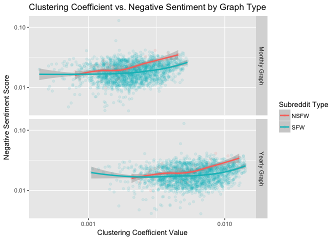
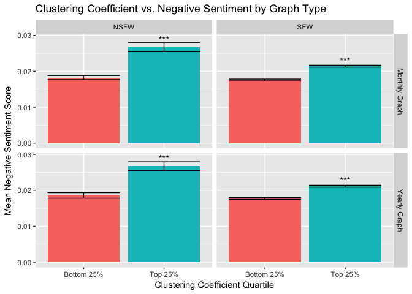
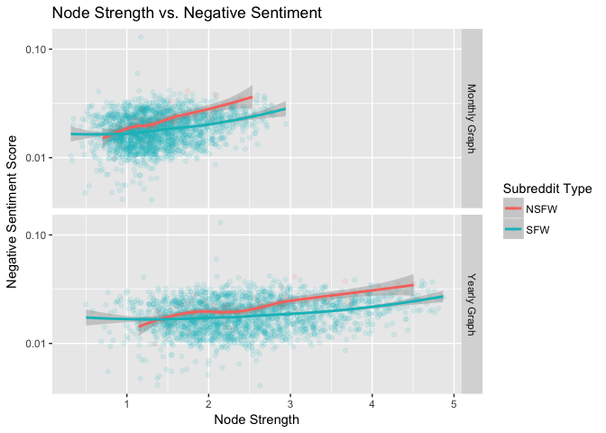
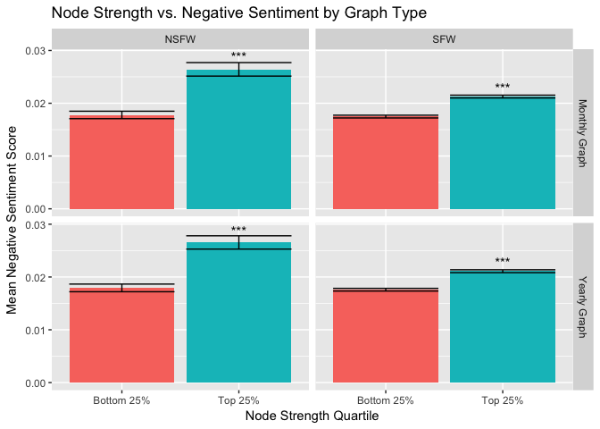
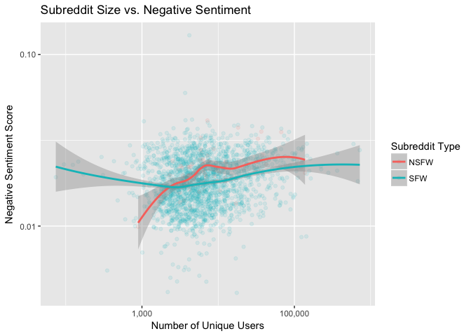
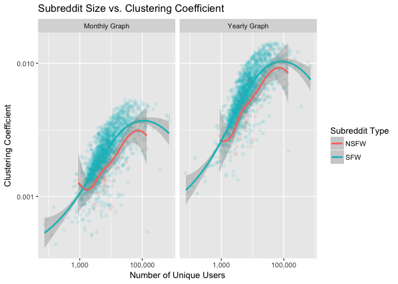

NSFW Analysis
================
Samuel Hansen

-   [Networks with Unfiltered Edges](#networks-with-unfiltered-edges)
    -   [Clustering Coefficient vs. Negative Sentiment](#clustering-coefficient-vs.-negative-sentiment)
        -   [Scatterplot](#scatterplot)
        -   [Regression](#regression)
        -   [Barplot](#barplot)
        -   [Mann-Whitney Tests](#mann-whitney-tests)
    -   [Node Strength vs. Negative Sentiment](#node-strength-vs.-negative-sentiment)
        -   [Scatterplot](#scatterplot-1)
        -   [Regression](#regression-1)
        -   [Barplot](#barplot-1)
        -   [Mann-Whitney Tests](#mann-whitney-tests-1)
    -   [Subreddit Size vs. Negative Sentiment](#subreddit-size-vs.-negative-sentiment)
        -   [Scatterplot](#scatterplot-2)
        -   [Regression](#regression-2)
    -   [Subreddit Size vs. Clustering Coefficient](#subreddit-size-vs.-clustering-coefficient)
        -   [Scatterplot](#scatterplot-3)

Networks with Unfiltered Edges
==============================

Clustering Coefficient vs. Negative Sentiment
---------------------------------------------

### Scatterplot

### Regression

#### Yearly Graph

    ## 
    ## Call:
    ## lm(formula = log10(negemo) ~ log10(clustering_coefficient) + 
    ##     nsfw_status, data = df %>% filter(network_type == "yearly"))
    ## 
    ## Residuals:
    ##      Min       1Q   Median       3Q      Max 
    ## -0.65621 -0.09422  0.00431  0.09617  0.86508 
    ## 
    ## Coefficients:
    ##                               Estimate Std. Error t value Pr(>|t|)    
    ## (Intercept)                   -1.30151    0.04170 -31.211  < 2e-16 ***
    ## log10(clustering_coefficient)  0.16586    0.01675   9.900  < 2e-16 ***
    ## nsfw_statusSFW                -0.07059    0.01544  -4.573 5.11e-06 ***
    ## ---
    ## Signif. codes:  0 '***' 0.001 '**' 0.01 '*' 0.05 '.' 0.1 ' ' 1
    ## 
    ## Residual standard error: 0.1426 on 2015 degrees of freedom
    ## Multiple R-squared:  0.05259,    Adjusted R-squared:  0.05165 
    ## F-statistic: 55.92 on 2 and 2015 DF,  p-value: < 2.2e-16

#### Monthly Graph

    ## 
    ## Call:
    ## lm(formula = log10(negemo) ~ log10(clustering_coefficient) + 
    ##     +nsfw_status, data = df %>% filter(network_type == "monthly"))
    ## 
    ## Residuals:
    ##      Min       1Q   Median       3Q      Max 
    ## -0.64191 -0.09453  0.00397  0.09533  0.87279 
    ## 
    ## Coefficients:
    ##                               Estimate Std. Error t value Pr(>|t|)    
    ## (Intercept)                   -1.14138    0.05106 -22.355  < 2e-16 ***
    ## log10(clustering_coefficient)  0.19582    0.01753  11.168  < 2e-16 ***
    ## nsfw_statusSFW                -0.07605    0.01537  -4.946 8.19e-07 ***
    ## ---
    ## Signif. codes:  0 '***' 0.001 '**' 0.01 '*' 0.05 '.' 0.1 ' ' 1
    ## 
    ## Residual standard error: 0.1417 on 2015 degrees of freedom
    ## Multiple R-squared:  0.06441,    Adjusted R-squared:  0.06348 
    ## F-statistic: 69.36 on 2 and 2015 DF,  p-value: < 2.2e-16

### Barplot

### Mann-Whitney Tests

#### Yearly Graph

##### SFW

    ## 
    ##  Wilcoxon rank sum test with continuity correction
    ## 
    ## data:  negemo by quartile
    ## W = 79091, p-value < 2.2e-16
    ## alternative hypothesis: true location shift is not equal to 0

##### NSFW

    ## 
    ##  Wilcoxon rank sum test
    ## 
    ## data:  negemo by quartile
    ## W = 41, p-value = 6.09e-08
    ## alternative hypothesis: true location shift is not equal to 0

#### Monthly Graph

##### SFW

    ## 
    ##  Wilcoxon rank sum test with continuity correction
    ## 
    ## data:  negemo by quartile
    ## W = 74485, p-value < 2.2e-16
    ## alternative hypothesis: true location shift is not equal to 0

##### NSFW

    ## 
    ##  Wilcoxon rank sum test
    ## 
    ## data:  negemo by quartile
    ## W = 25, p-value = 2.257e-09
    ## alternative hypothesis: true location shift is not equal to 0

Node Strength vs. Negative Sentiment
------------------------------------

### Scatterplot

### Regression

#### Yearly Graph

    ## 
    ## Call:
    ## lm(formula = log10(negemo) ~ node_strength + nsfw_status, data = df %>% 
    ##     filter(network_type == "yearly"))
    ## 
    ## Residuals:
    ##      Min       1Q   Median       3Q      Max 
    ## -0.65318 -0.09133  0.00668  0.09564  0.86938 
    ## 
    ## Coefficients:
    ##                 Estimate Std. Error  t value Pr(>|t|)    
    ## (Intercept)    -1.790484   0.017392 -102.947  < 2e-16 ***
    ## node_strength   0.045386   0.003917   11.586  < 2e-16 ***
    ## nsfw_statusSFW -0.064594   0.015260   -4.233 2.41e-05 ***
    ## ---
    ## Signif. codes:  0 '***' 0.001 '**' 0.01 '*' 0.05 '.' 0.1 ' ' 1
    ## 
    ## Residual standard error: 0.1414 on 2015 degrees of freedom
    ## Multiple R-squared:  0.06856,    Adjusted R-squared:  0.06763 
    ## F-statistic: 74.15 on 2 and 2015 DF,  p-value: < 2.2e-16

A 1 unit change in node strength is associated with a 0.044% change in negative sentiment.

#### Monthly Graph

    ## 
    ## Call:
    ## lm(formula = log10(negemo) ~ log10(node_strength) + nsfw_status, 
    ##     data = df %>% filter(network_type == "monthly"))
    ## 
    ## Residuals:
    ##      Min       1Q   Median       3Q      Max 
    ## -0.64430 -0.09416  0.00506  0.09529  0.86823 
    ## 
    ## Coefficients:
    ##                      Estimate Std. Error  t value Pr(>|t|)    
    ## (Intercept)          -1.71140    0.01504 -113.772  < 2e-16 ***
    ## log10(node_strength)  0.25818    0.02204   11.716  < 2e-16 ***
    ## nsfw_statusSFW       -0.06304    0.01524   -4.135 3.69e-05 ***
    ## ---
    ## Signif. codes:  0 '***' 0.001 '**' 0.01 '*' 0.05 '.' 0.1 ' ' 1
    ## 
    ## Residual standard error: 0.1413 on 2015 degrees of freedom
    ## Multiple R-squared:  0.06986,    Adjusted R-squared:  0.06894 
    ## F-statistic: 75.67 on 2 and 2015 DF,  p-value: < 2.2e-16

### Barplot

### Mann-Whitney Tests

#### Yearly Graph

##### SFW

    ## 
    ##  Wilcoxon rank sum test with continuity correction
    ## 
    ## data:  negemo by quartile
    ## W = 77929, p-value < 2.2e-16
    ## alternative hypothesis: true location shift is not equal to 0

##### NSFW

    ## 
    ##  Wilcoxon rank sum test
    ## 
    ## data:  negemo by quartile
    ## W = 41, p-value = 6.09e-08
    ## alternative hypothesis: true location shift is not equal to 0

#### Monthly Graph

##### SFW

    ## 
    ##  Wilcoxon rank sum test with continuity correction
    ## 
    ## data:  negemo by quartile
    ## W = 74256, p-value < 2.2e-16
    ## alternative hypothesis: true location shift is not equal to 0

##### NSFW

    ## 
    ##  Wilcoxon rank sum test
    ## 
    ## data:  negemo by quartile
    ## W = 36, p-value = 2.365e-08
    ## alternative hypothesis: true location shift is not equal to 0

Subreddit Size vs. Negative Sentiment
-------------------------------------

### Scatterplot

### Regression

    ## 
    ## Call:
    ## lm(formula = log10(negemo) ~ log10(unique_users) + nsfw_status, 
    ##     data = df %>% distinct(subreddit, unique_users, negemo, nsfw_status))
    ## 
    ## Residuals:
    ##      Min       1Q   Median       3Q      Max 
    ## -0.67082 -0.09384  0.00388  0.09631  0.86667 
    ## 
    ## Coefficients:
    ##                      Estimate Std. Error t value Pr(>|t|)    
    ## (Intercept)         -1.912560   0.030640 -62.421  < 2e-16 ***
    ## log10(unique_users)  0.059069   0.006966   8.480  < 2e-16 ***
    ## nsfw_statusSFW      -0.056428   0.015473  -3.647 0.000272 ***
    ## ---
    ## Signif. codes:  0 '***' 0.001 '**' 0.01 '*' 0.05 '.' 0.1 ' ' 1
    ## 
    ## Residual standard error: 0.1435 on 2015 degrees of freedom
    ## Multiple R-squared:  0.04074,    Adjusted R-squared:  0.03978 
    ## F-statistic: 42.78 on 2 and 2015 DF,  p-value: < 2.2e-16

Subreddit Size vs. Clustering Coefficient
-----------------------------------------

### Scatterplot

